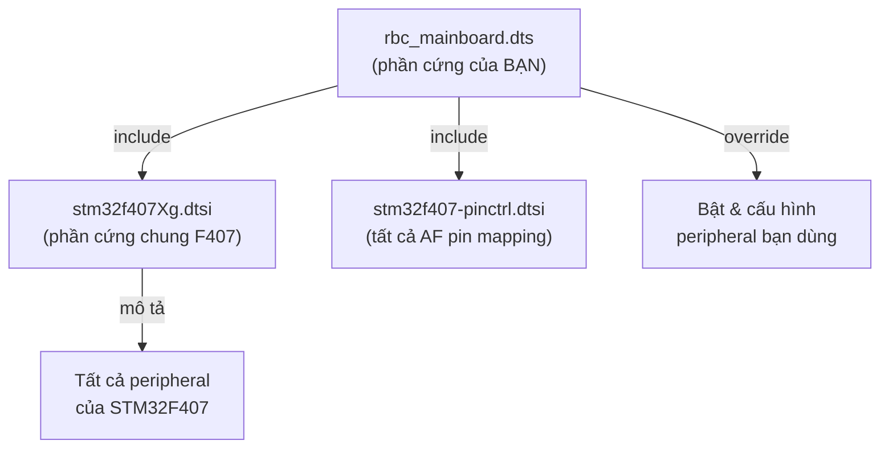
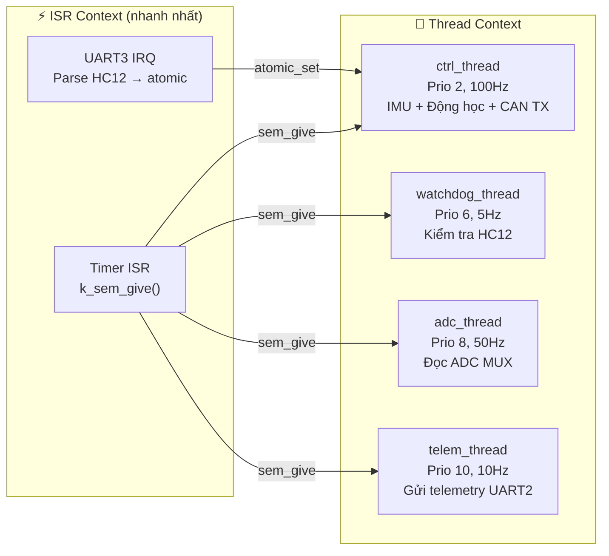
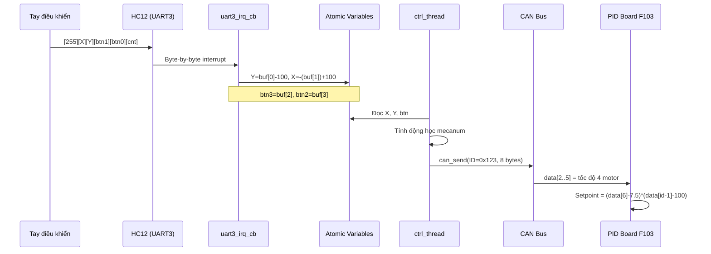

# RBC2026 Mainboard - Zephyr Project Walkthrough

> Dành cho người mới tiếp cận Zephyr. So sánh trực tiếp với STM32 HAL/CubeIDE.

---

## 1. Cây thư mục

```
rbc_r1/
├── CMakeLists.txt            ← Build config (tương tự Makefile)
├── prj.conf                  ← BẬT/TẮT tính năng (CAN, I2C, UART...)
├── boards/
│   └── rbc_mainboard/
│       ├── board.yml              ← Khai báo tên board + chip
│       ├── board.cmake            ← Cấu hình flash (ST-Link, OpenOCD)
│       ├── rbc_mainboard.dts      ← ⭐ DEVICE TREE - thay thế CubeMX .ioc
│       ├── rbc_mainboard.yaml     ← Metadata board
│       ├── rbc_mainboard_defconfig← Config mặc định cho board
│       └── Kconfig.rbc_mainboard  ← Kconfig riêng board
├── src/
│   ├── main.c                ← ⭐ CODE CHÍNH - logic điều khiển
│   ├── bno055.c / .h         ← Driver BNO055 IMU
│   ├── bno055_zephyr.c / .h  ← Adapter: BNO055 → Zephyr I2C API
│   ├── pca9685_zephyr.c      ← Driver PCA9685 servo (Zephyr I2C)
│   └── pca9685.h             ← Header PCA9685
├── build/                    ← ⚙️ Thư mục build (tự sinh, KHÔNG sửa)
│   └── zephyr/
│       ├── zephyr.elf / .bin / .hex  ← Firmware output
│       └── zephyr.dts               ← DTS đã merge (debug)
├── code_cu/                  ← 📦 Code cũ HAL (tham khảo)
│   └── main.c                ← Code gốc STM32 HAL CubeMX
└── main_pid_board.c          ← 📦 Code PID board F103 (tham khảo)
```

---

## 2. So sánh HAL (CubeMX) vs Zephyr

### Cấu hình phần cứng

| Việc | CubeMX/HAL | Zephyr |
|---|---|---|
| Chọn pin, clock, peripheral | File `.ioc` (GUI) | File `.dts` (text) |
| Bật/tắt tính năng | `#define` trong code | File `prj.conf` |
| Init peripheral | `MX_xxx_Init()` tự sinh | Zephyr driver tự init từ DTS |
| Cấu hình clock | `SystemClock_Config()` | Trong `.dts` (node `&clk_hse`, `&pll`, `&rcc`) |

### Ví dụ: Cấu hình CAN

**CubeMX/HAL** (trong code):
```c
hcan1.Init.Prescaler = 4;
hcan1.Init.TimeSeg1 = CAN_BS1_13TQ;
hcan1.Init.TimeSeg2 = CAN_BS2_2TQ;
HAL_CAN_Init(&hcan1);
HAL_CAN_Start(&hcan1);
```

**Zephyr** (trong `.dts` + code):
```dts
/* rbc_mainboard.dts */
&can1 {
    pinctrl-0 = <&can1_rx_pd0 &can1_tx_pd1>;
    status = "okay";
    bus-speed = <562500>;    /* Zephyr tự tính prescaler, TS1, TS2 */
    sample-point = <875>;
};
```
```c
/* main.c - chỉ cần start và send */
can_start(can1_dev);
can_send(can1_dev, &can1_tx, K_NO_WAIT, NULL, NULL);
```

> [!IMPORTANT]
> Trong Zephyr, **KHÔNG cần gọi init**. Driver tự init dựa trên DTS. Bạn chỉ cần `start` và `send/receive`.

---

## 3. File quan trọng giải thích chi tiết

### 3.1 `prj.conf` — Bật/tắt tính năng

```conf
CONFIG_CAN=y           # Bật driver CAN
CONFIG_I2C=y           # Bật driver I2C  
CONFIG_SERIAL=y        # Bật driver UART
CONFIG_UART_INTERRUPT_DRIVEN=y  # UART dùng interrupt (cho HC12)
CONFIG_ADC=y           # Bật driver ADC
CONFIG_FPU=y           # Bật FPU (tính toán float)
CONFIG_NEWLIB_LIBC=y   # Dùng newlib (hỗ trợ printf, sinf...)
```

> [!TIP]
> Tương đương với việc tick checkbox trong CubeMX. Nếu thiếu `CONFIG_CAN=y`, code dùng CAN sẽ không compile.

### 3.2 `rbc_mainboard.dts` — Device Tree (thay .ioc)



**Cấu trúc DTS:**
```dts
/* 1. Clock */
&clk_hse { clock-frequency = <8000000>; };  /* Thạch anh 8MHz */
&pll { div-m=4; mul-n=144; div-p=2; };      /* SYSCLK = 144MHz */
&rcc { apb1-prescaler=4; };                  /* APB1 = 36MHz */

/* 2. Peripheral - bật bằng status = "okay" */
&can1 {
    pinctrl-0 = <&can1_rx_pd0 &can1_tx_pd1>;  /* Chọn pin */
    status = "okay";                            /* BẬT */
    bus-speed = <562500>;
};

/* 3. GPIO - LED, button, output */
leds {
    compatible = "gpio-leds";
    led0: led_pc13 { gpios = <&gpioc 13 GPIO_ACTIVE_LOW>; };
};
```

> [!NOTE]
> Mỗi peripheral mặc định `status = "disabled"`. Bạn phải set `"okay"` để bật. Tương tự CubeMX tick "Activated".

### 3.3 `CMakeLists.txt` — File nào được compile

```cmake
target_sources(app PRIVATE
    src/main.c              # Code chính
    src/bno055.c            # Driver IMU  
    src/bno055_zephyr.c     # Adapter I2C cho IMU
    src/pca9685_zephyr.c    # Driver servo
)
```

> [!TIP]
> Thêm file `.c` mới? Thêm vào đây. Tương đương kéo file vào project CubeIDE.

---

## 4. Kiến trúc main.c

### 4.1 Lấy device từ Device Tree (thay thế extern handle)

```c
/* HAL cũ: */
extern CAN_HandleTypeDef hcan1;    /* CubeMX tự sinh */

/* Zephyr: */
#define CAN1_NODE DT_NODELABEL(can1)                /* Tìm node "can1" trong DTS */
static const struct device *can1_dev = DEVICE_DT_GET(CAN1_NODE);  /* Lấy device */
```

### 4.2 Thread Architecture (thay thế HAL_TIM interrupt)



**So sánh với HAL:**

| HAL (code cũ) | Zephyr (code mới) |
|---|---|
| `HAL_TIM_PeriodElapsedCallback(TIM1)` → xử lý trực tiếp trong ISR | Timer ISR chỉ `k_sem_give()` → `ctrl_thread` xử lý |
| `HAL_TIM_PeriodElapsedCallback(TIM8)` → watchdog trong ISR | Timer ISR chỉ `k_sem_give()` → `watchdog_thread` xử lý |
| Mọi thứ chạy trong interrupt → priority inversion risk | Thread riêng biệt → an toàn, dễ debug |

### 4.3 Data Flow: Joystick → Motor



### 4.4 Mapping CAN data → Motor

```
CAN Frame ID=0x123, DLC=8:
┌──────┬──────┬──────┬──────┬──────┬──────┬──────┬──────┐
│ [0]  │ [1]  │ [2]  │ [3]  │ [4]  │ [5]  │ [6]  │ [7]  │
│ 100  │ 100  │ M1   │ M2   │ M3   │ M4   │ db=9 │ 100  │
│      │      │ ID3  │ ID4  │ ID5  │ ID6  │      │      │
└──────┴──────┴──────┴──────┴──────┴──────┴──────┴──────┘
                 ↓      ↓      ↓      ↓
                W1     W2     W3     W4
              (FL)   (FR)   (RL)   (RR)
              
Giá trị 100 = dừng, >100 = quay thuận, <100 = quay nghịch
PID setpoint = (db - 7.5) × (data[i] - 100) = 1.5 × (data[i] - 100)
```

---

## 5. Chia sẻ dữ liệu an toàn: Atomic

```c
/* Vấn đề: UART ISR ghi X,Y cùng lúc ctrl_thread đọc → data race */

/* HAL cũ: KHÔNG an toàn (nhưng chạy vì ISR nhanh) */
float X, Y;  /* Global, ISR và main loop cùng truy cập */

/* Zephyr: Dùng atomic (lock-free, ISR-safe) */
static atomic_t rx_x10 = ATOMIC_INIT(0);  /* X × 10, tránh float */

/* ISR ghi: */
atomic_set(&rx_x10, (int)(X_value * 10));

/* Thread đọc: */
float X = (float)atomic_get(&rx_x10) / 10.0f;
```

> [!NOTE]
> `atomic_t` chỉ lưu được `int`. Nên nhân 10 để giữ 1 chữ số thập phân, rồi chia 10 khi đọc.

---

## 6. Các lệnh thường dùng

```bash
# Activate Zephyr environment
source ~/zephyrpy/bin/activate

# Build (incremental - chỉ compile file thay đổi)
west build -b rbc_mainboard

# Build (clean - rebuild toàn bộ, dùng khi đổi DTS/conf)
west build -b rbc_mainboard -p

# Flash qua ST-Link
west flash

# Xem console log (USART1, 115200)
west espressif monitor  # hoặc minicom/putty
```

> [!WARNING]
> Khi sửa file `.dts` hoặc `prj.conf`, **PHẢI build với `-p`** (pristine). Build thường sẽ không nhận thay đổi DTS!

---

## 7. Muốn thêm/sửa gì?

| Muốn... | Sửa file nào |
|---|---|
| Thêm peripheral mới (SPI, UART...) | `rbc_mainboard.dts` + `prj.conf` |
| Đổi pin | `rbc_mainboard.dts` (pinctrl) |
| Đổi clock/baudrate | `rbc_mainboard.dts` |
| Thêm file .c mới | `CMakeLists.txt` |
| Thêm thread mới | `src/main.c` (xem pattern ctrl_thread) |
| Đổi logic điều khiển | `src/main.c` → `ctrl_thread_fn()` |
| Đổi protocol HC12 | `src/main.c` → `uart3_irq_cb()` |
| Thêm thư viện (printf float...) | `prj.conf` |

---

## 8. File tham khảo so sánh

| File Zephyr | Tương đương HAL |
|---|---|
| [rbc_mainboard.dts](file:///home/tuangaooo/zephyrproject/rbc_r1/boards/rbc_mainboard/rbc_mainboard.dts) | `RBC2026_MAINBOARD_OK.ioc` + `MX_xxx_Init()` |
| [prj.conf](file:///home/tuangaooo/zephyrproject/rbc_r1/prj.conf) | `#define HAL_CAN_MODULE_ENABLED` trong `stm32f4xx_hal_conf.h` |
| [main.c](file:///home/tuangaooo/zephyrproject/rbc_r1/src/main.c) | [code_cu/main.c](file:///home/tuangaooo/zephyrproject/rbc_r1/code_cu/main.c) |
| [main_pid_board.c](file:///home/tuangaooo/zephyrproject/rbc_r1/main_pid_board.c) | Code PID board F103 (không đổi, vẫn dùng HAL) |
